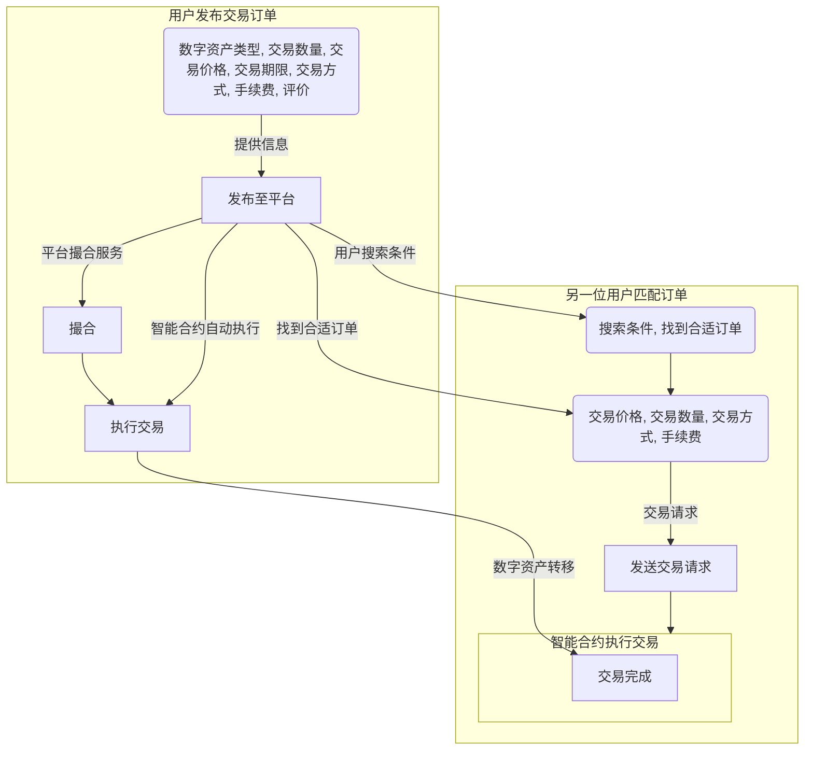

    
    
    
    

## 基本资料	

### 项目名称

NeMA

## 项目整体介绍

### 项目logo

### 项目背景

* 信任关系：场外交易市场是去中心化的，与常规交易所不同，没有中央机构的监督。如果交易一方选择不履行义务，另一方就会遭受重大损失，于是就出现了交易双方以及交易双方对担保人的信任危机。
* 传统OTC人工担保风险高，手续费昂贵。

### 项目简介

NeMA是一个多功能集成的OTC交易平台，致力于将 Web3 的线下交易桥接到链上，同时通过区块链技术为买卖双方提供基于区块链的稳定担保服务，实现用户于平台之间的互信互惠互利。主要服务包括c2c+otc模式的场外交易支持、NFT白名单交易/Pol-20 现货交易支持等。

## 技术亮点

#### 哈希锁定

哈希锁定模式是指用户在规定的时间段对于哈希值的原值进行猜测来支付的一种机制。它允许用户通过提供一个哈希值来锁定一定数量的代币，并在满足特定条件时进行提取。用户在锁定代币时需要提供一个哈希值，该哈希值与特定条件相关联。当满足条件时，用户可以提供与哈希值相匹配的原始数据来解锁并提取代币。简单讲，就是在智能合约的基础上，双方先锁定资产，如果都在有限的时间内输入正确哈希值的原值，即可完成交易。NeMA在这样的机制下可以实现小额支付的快速确认以及安全的交易和条件付款，确保交易的可信性和可靠性。

### Dapp主要功能

#### 场外交易支持

主要存在两种情况：1.平台挂单，用户通过平台撮合进行交易。2.用户事先达成共识，平台仅提供合约支持。

**主要流程：**

1. 用户提供交易的数字资产类型、交易的数量、交易的价格、交易的期限等信息在平台挂单。

用户还可以选择以下选项：交易方式：限价单、市价单、止损单、止盈单；交易评价等。
用户在发布订单后，订单将在平台上公开展示。

2. 另一位用户可以通过平台搜索符合条件的交易订单。如果找到合适的订单，可以发送交易请求。

交易请求中需要包含以下信息：交易的价格、交易的数量。该用户同样可以选择交易方式（限价单、市价单）。

注意：成功发送交易请求的前提是买家提前将资产质押到智能合约中。

3. 卖家确认后转移资产，卖家收到通知后将资产转移到买家账户，等待买家确认。

4. 买家确认资产成功到账，则智能合约自动执行交易，将数字资产从一方转移到另一方，交易信息上链。

#### NFT白名单交易/Pol-20 现货交易支持

一般流程：

1. 发布白名单交易订单

卖家在平台上发布白名单交易订单，一般要求提供以下信息：NFT项目名称、白名单名额数量、交易价格（支持多种加密货币计价）、交易方式、交易截止时间、其他可选信息。

2. 搜索白名单交易订单

买家可以通过平台搜索符合条件的白名单交易订单。可以根据以下条件进行筛选：NFT项目名称、价格范围、交易方式、卖家信誉

3. 合约自动与前端交互，自动执行资产转移，保障交易。

3. 交易完成后，买家可以正常参与NFT项目的铸造或预售，获得NFT资产。平台允许交易双方互相评价，建立平台信誉体系。

   

**Pol-20现货交易与上述基本流程大同小异，值得一提的是，目前还没出现支持pol-20现货交易的平台。**

全流程由平台提供担保，保障交易安全。同时给出温馨提示：

NFT白名单交易是一个新兴的市场，存在一定的风险。
买家在交易之前应仔细审核项目信息，并选择信誉良好的卖家。
卖家应确保所提供的白名单名额真实有效。

## 黑客松期间计划完成的事项

### 前端开发

UI开发是项目中至关重要的一环，它直接关系到用户体验和整体项目的可用性。

1. **需求分析：** 明确项目的功能和业务需求。确定用户在Web端需要执行的操作，例如注册、登录、浏览信息、发起交易等。
2. **界面设计：** 制定UI设计方案，包括页面布局、颜色搭配、图标使用等。考虑到用户友好性，确保界面简洁清晰，易于导航。
3. **响应式设计：** 确保UI在不同屏幕尺寸和设备上都能正常显示和操作，采用响应式设计原则进行布局。
4. **交互设计：** 设计良好的交互流程，确保用户能够顺利完成各项操作。包括表单验证、错误提示、加载状态等。
5. **前端与链端交互：** 通过API或其他方式与链端进行数据交互，确保前端能够获取和展示后端返回的数据。
6. **测试与优化：**包括功能测试、性能测试、兼容性测试等。根据测试结果进行优化，确保系统稳定运行。

### OTC交易的合约支持（包括基础代币交易、NFT白单以及pol-20铭文交易）

OTC交易合约需要满足双方的交易需求，确保安全、透明和可执行。以下是合约编写的关键点：

1. **资金锁定机制：** 设计合约以确保交易双方的资金安全，采用锁定和释放机制，防止欺诈行为。
2. **交易参数：** 定义交易的相关参数，包括交易数量、价格、交易方身份验证等。
3. **交易状态：** 在合约中定义不同的交易状态，以确保交易的顺利进行，包括订单创建、付款、确认等状态。
4. **前端集成：** 与前端开发人员密切合作，确保前端能够正确地与合约进行交互，实现交易的展示和操作。

### Hashlock技术引入

主要步骤包括：

1. **合约设计：** 在智能合约中实现Hashlock逻辑，包括锁定资产、验证哈希条件、解锁资产等。

2. **交易原子性：** 保证交易的原子性，即在交易完成之前，资产要么被锁定，要么被解锁，防止中间状态的出现。
3. **合约安全性：** 考虑智能合约的安全性，防止重入攻击和其他潜在的漏洞。
4. **事件通知：** 在合约中设置事件，以便用户和前端可以监听合约的状态变化，及时更新UI。
5. **测试与优化：** 包括功能测试、安全性测试等。根据测试结果进行合约的优化。

### **文档编写**

编写清晰详尽的介绍文档和使用手册。

## API

| 函数名称                       | 参数                                                    | 返回值类型           | 描述                                                         |
| ------------------------------ | ------------------------------------------------------- | -------------------- | ------------------------------------------------------------ |
| `lock`                         | `_hash: string`                                         | `string`             | 锁定提案，返回结果字符串。如果提案不存在、已完成或已回滚，则返回相应的错误信息。 |
| `unlock`                       | `_hash: string`, `_secret: string`                      | `string`             | 解锁提案，返回结果字符串。如果提案不存在、已完成、未锁定或已回滚，则返回相应的错误信息。 |
| `rollback`                     | `_hash: string`                                         | `string`             | 回滚提案，返回结果字符串。如果提案不存在、已完成、未锁定、已解锁或已回滚，则返回相应的错误信息。 |
| `newProposal`                  | `_hash: string`, `_role: string`, ...                   | `string`             | 创建新提案，返回结果字符串。如果提案已存在、时间锁设置不正确或角色不匹配，则返回相应的错误信息。 |
| `setNewProposalTxInfo`         | `_hash: string`, `_txHash: string`, `_blockNum: string` | 无返回值             | 设置新提案的交易信息。                                       |
| `getNewProposalTxInfo`         | `_hash: string`                                         | `string`             | 获取新提案的交易信息。如果交易信息不存在，则返回 "null"。    |
| `getNegotiatedData`            | `_hash: string`                                         | `string`             | 获取已协商的数据，返回包含发起者和参与者信息的字符串。如果提案不存在，则返回相应的错误信息。 |
| `getProposalInfo`              | `_hash: string`                                         | `string`             | 获取提案的详细信息，返回包含提案状态和相关标志的字符串。如果提案不存在，则返回 "null"。 |
| `setSecret`                    | `_hash: string`, `_secret: string`                      | `string`             | 设置提案的密钥，返回结果字符串。如果提供的密钥不匹配哈希值，则返回相应的错误信息。 |
| `getProposalIDs`               | 无                                                      | `string`             | 获取所有提案的哈希值，返回包含所有哈希值的字符串。           |
| `deleteProposalID`             | `_id: string`                                           | `string`             | 删除指定哈希值的提案，返回结果字符串。如果提案不存在或删除失败，则返回相应的错误信息。 |
| `getIndex`                     | `_hash: string`                                         | `(uint256, uint256)` | 获取提案在队列中的索引和深度。                               |
| `setCounterpartyLockState`     | `_hash: string`                                         | 无返回值             | 设置对方的锁定状态。                                         |
| `setCounterpartyUnlockState`   | `_hash: string`                                         | 无返回值             | 设置对方的解锁状态。                                         |
| `setCounterpartyRollbackState` | `_hash: string`                                         | 无返回值             | 设置对方的回滚状态。                                         |

## 测试

src文件夹中包含了针对合约功能的测试用例，前期已经通过`truffle test`进行了部分的本地测试。

## 队员信息	

|  名称  |         角色         |  GitHub账号  |    微信账号    |
| :----: | :------------------: | :----------: | :------------: |
| V1cent | full-stack developer | L011apa100za | SWS18312967544 |

## License

[License](./LICENSE)
